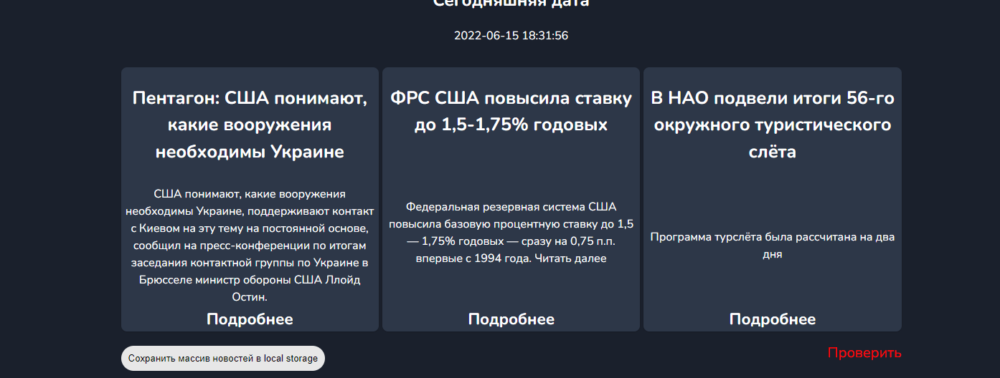
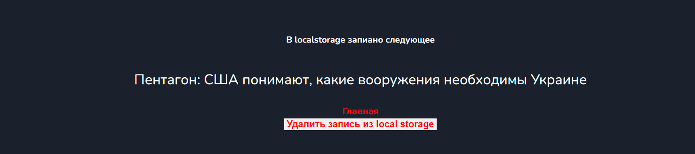
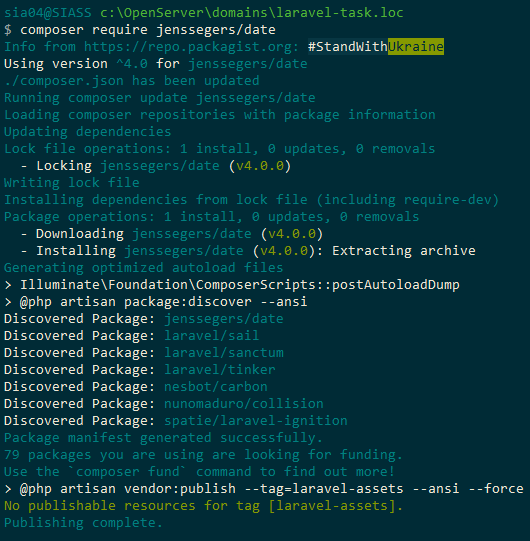
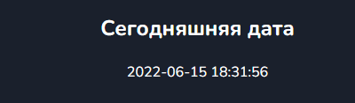

8-е занятие
Подключил api из предидущих занятий с новостями

вывел 3 новости, добавил кнопку для сохранения title первой новости в localstorage, и ссылку для перехода 
на страницу проверки
добавил кнопку асинхрнного запроса fetch для вывода текущего курса долара.
В route.php прописал маршрут длдя перехода на страницу проверки на странице проверки js-ом вывел содержимое
localstorage на экран

Так же на ней вывел кнопку очистки localstroge и ссалку перехода на главную

9-е занятие:
 Установил laravel
 подключил модуль Date

