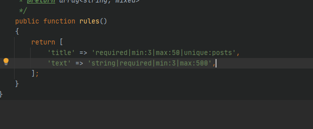
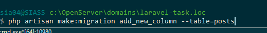
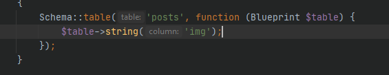
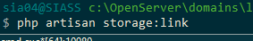
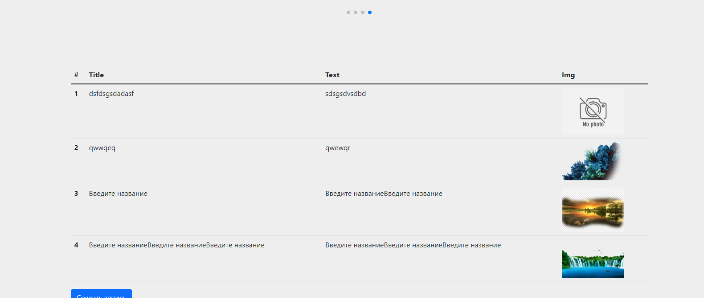
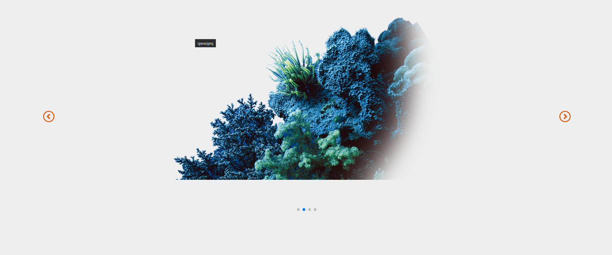

12 занятие 
сооздал request
командой php artisan make:request StorePostRequest
Там прописал правила 

Добавил в таблицу posts поле img

Создал символьную ссылку чтобы получить путь для картинки
 

В котроллере PostController прописал команды сохранения пути загружаемой картинки в
базу данных
На странице вывода постов добавил в таблицу миниатюры загруженных картинок

и добавил слайде swiper slider в шапку сайта)))
Создал ресурсный контроллер

