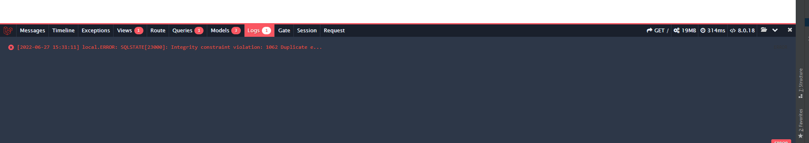
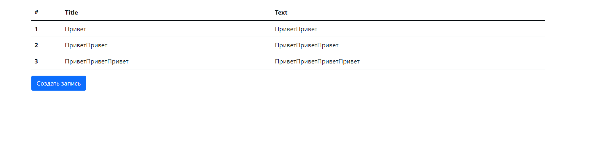
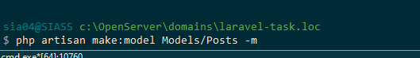
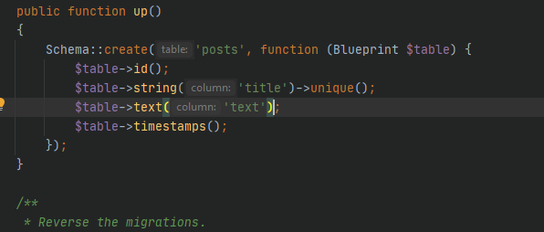
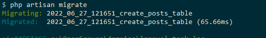
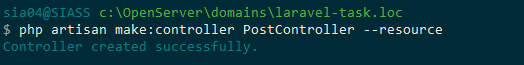
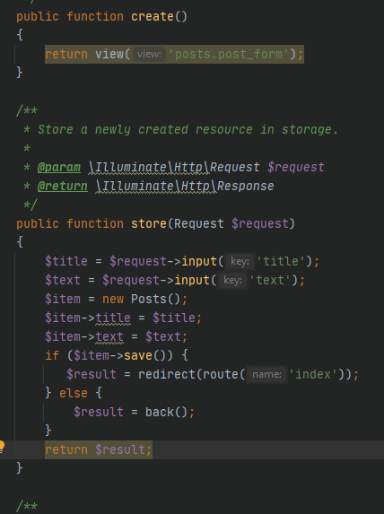
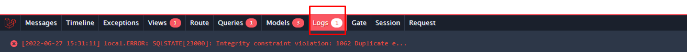

11 занятие 
Установил  debugbar

На главной странице сделал выыод постов

Так же на ней вывел кнопку добавления постов
Создал модель и миграцию

В миграции указал что какие столбцы создавать 

Запустил миграцию

Создал ресурсный контроллер

В нем прписал методы

Добавил папку вывода логов к вкалдкам дебагбара

